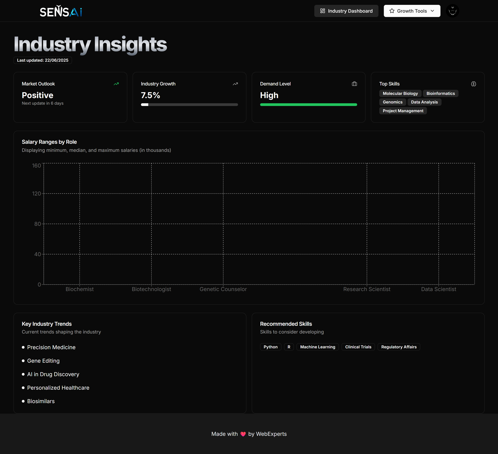

# 🌱 Sansai


> **AI Career Coach for Professional Success**

Sansai is an AI-powered full-stack career assistant web app designed to supercharge your professional journey. With interactive tools and AI-driven features, it helps you stay updated on in-demand skills, create optimized resumes, and prepare for interviews like never before.

---

## 🚀 Live Demo  
👉 [Click to Visit](https://sansai-ten.vercel.app)

---

## 📚 Features

✅ **AI-Powered Career Dashboard**  
- Weekly updates on in-demand skills & salary trends  
- Industry-specific insights in a beautiful interactive dashboard  

✅ **AI Resume Builder**  
- Generate ATS-optimized resumes based on your skills and industry  
- Fully customizable templates & content suggestions  

✅ **Mock Interview Simulator**  
- Get realistic interview questions based on your role  
- Track performance over time  
- Get AI-generated tips and improvements  

✅ **Authentication & Account Management**  
- Secure login/signup with Clerk  
- Manage your profile and progress easily  

✅ **Fully Responsive & Beautiful UI**  
- Built with modern UI libraries & best practices  
- Works smoothly across desktop, tablet, and mobile

---

## 🛠️ Tech Stack

- ⚛️ **React 19** + **Next.js 15**  
- 🎨 **Tailwind CSS**  
- 🔐 **Clerk Authentication**  
- 💾 **Prisma** + **NeonDB**  
- 🧠 **Gemini AI API**  
- 🪄 **Inngest** for background tasks  
- 🧱 **Shadcn UI** for clean UI components  
- ☁️ **Vercel** for deployment

---

| OG Image | Dashboard | Resume Builder | Interview |
|----------|-----------|----------------|-----------|
|  |  |  |  |


---

## 📂 How to Run Locally

```bash
git clone https://github.com/darshan440/sansai.git
cd sansai
npm install
npx prisma generate
npm run dev 

```
## 🧑‍💻 Author

Built with ❤️ by [Darshan](https://github.com/darshan440)  
📧 Email: darshanthakkar782@example.com  
🎓 Dev | 🚀 Learner | 🏆 Builder

